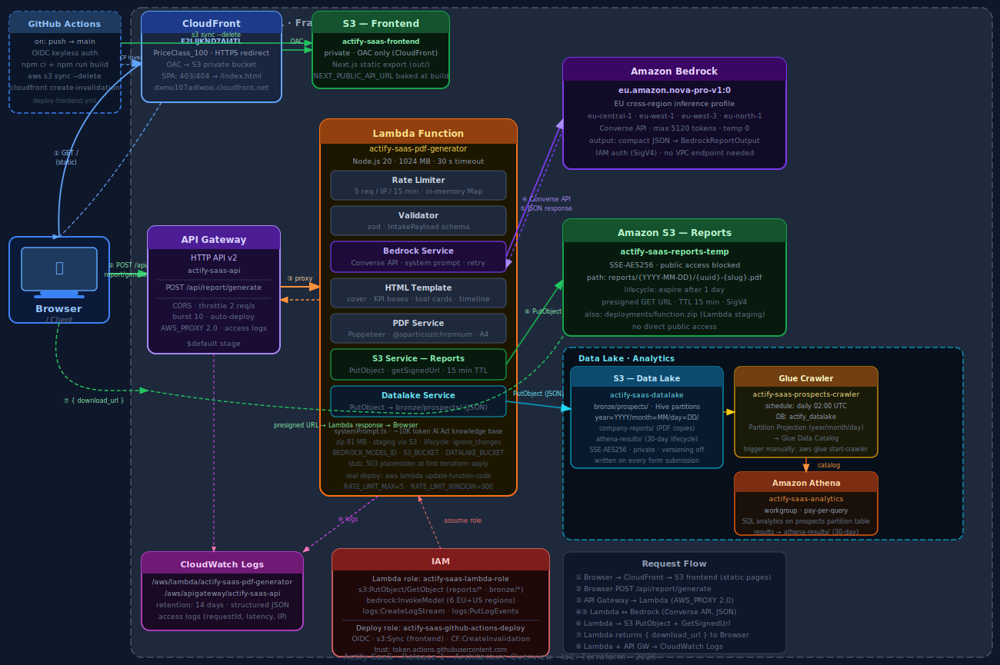

# Actify SaaS — Release 1: Technical Documentation

**Prodotto:** Actify — EU AI Act Compliance Assessment  
**Release:** 1 (Demo)  
**Regione AWS:** eu-central-1 (Frankfurt)  
**IaC:** Terraform  
**Data:** 2025

---

## Panoramica

Actify è un servizio B2B che permette alle aziende di valutare la loro conformità al **Regolamento UE 2024/1689 (AI Act)**. L'utente compila un form di assessment, il sistema lo elabora tramite un modello AI su Amazon Bedrock, genera un report PDF e restituisce un link di download temporaneo.

**Endpoint pubblico:** `https://lql1qfmdua.execute-api.eu-central-1.amazonaws.com`

---

## Diagramma di architettura



---

## Flusso end-to-end

| Step | Evento | Attore |
|------|--------|--------|
| ① | `GET /` — il browser richiede il form | Browser → API Gateway → Lambda |
| ② | Utente compila il wizard (7 step) e invia | Browser |
| ③ | `POST /api/report/generate` — payload JSON | Browser → API Gateway → Lambda |
| ④ | Lambda valida il payload con zod e controlla il rate limit | Lambda |
| ⑤ | Lambda chiama Bedrock (Converse API) con il system prompt AI Act | Lambda → Bedrock |
| ⑥ | Bedrock restituisce un JSON strutturato (`BedrockReportOutput`) | Bedrock → Lambda |
| ⑦ | Lambda renderizza HTML e genera il PDF con Puppeteer + Chromium | Lambda |
| ⑧ | Lambda carica il PDF su S3 e genera una presigned URL (15 min TTL) | Lambda → S3 |
| ⑨ | Lambda restituisce `{ download_url }` al browser | Lambda → API Gateway → Browser |
| ⑩ | Lambda e API Gateway scrivono i log strutturati su CloudWatch | Lambda, API GW → CloudWatch |

---

## Servizi AWS

### 1. Amazon API Gateway HTTP API v2

| Proprietà | Valore |
|-----------|--------|
| Nome | `actify-saas-api` |
| Tipo | HTTP API (v2) — non REST API |
| Stage | `$default` (auto-deploy) |
| Route 1 | `GET /` → serve il form HTML |
| Route 2 | `POST /api/report/generate` → genera il report |
| Integrazione | `AWS_PROXY` payload format `2.0` |
| CORS | `allow_origins: *`, metodi `GET POST OPTIONS` |
| Throttling | burst 10 req, steady 2 req/s |
| Log group | `/aws/apigateway/actify-saas-api` |

**Perché HTTP API v2 e non REST API:** costo inferiore (~70%), latenza più bassa, supporto nativo per payload format 2.0, configurazione CORS semplificata a livello API. Per Release 1 non serve authorization custom né WAF a livello API.

---

### 2. AWS Lambda

| Proprietà | Valore |
|-----------|--------|
| Nome | `actify-saas-pdf-generator` |
| Runtime | Node.js 20.x |
| Handler | `dist/handler.handler` |
| Memory | 1024 MB |
| Timeout | 30 s |
| Deployment | Zip 81 MB via S3 staging |
| Deployment package | `@sparticuz/chromium` + `puppeteer-core` + AWS SDKs + zod |

**Variabili d'ambiente:**

| Variabile | Valore | Scopo |
|-----------|--------|-------|
| `BEDROCK_MODEL_ID` | `eu.amazon.nova-pro-v1:0` | Inference profile EU |
| `BEDROCK_REGION` | `eu-central-1` | Regione endpoint Bedrock |
| `BEDROCK_MAX_TOKENS` | `5120` | Limite output modello |
| `BEDROCK_TEMPERATURE` | `0` | Output deterministico |
| `S3_BUCKET` | `actify-saas-reports-temp` | Bucket destinazione PDF |
| `S3_REGION` | `eu-central-1` | Regione bucket S3 |
| `PRESIGNED_URL_TTL` | `900` | TTL URL in secondi (15 min) |
| `RATE_LIMIT_MAX` | `5` | Max richieste per IP per finestra |
| `RATE_LIMIT_WINDOW` | `900` | Finestra rate limit in secondi |
| `ENV` | `demo` | Ambiente |
| `LOG_LEVEL` | `info` | Livello di log |

**Componenti interni della Lambda (TypeScript):**

| Modulo | File | Responsabilità |
|--------|------|----------------|
| Handler | `handler.ts` | Entry point, orchestrazione del flusso |
| Rate Limiter | `middleware/rateLimiter.ts` | In-memory Map, 5 req/IP/15 min |
| Validator | `middleware/validator.ts` | Schema zod per `IntakePayload` |
| Bedrock Service | `services/bedrockService.ts` | Converse API, system prompt, retry |
| HTML Template | `services/htmlTemplate.ts` | Cover, KPI, tool cards, timeline |
| PDF Service | `services/pdfService.ts` | Puppeteer + Chromium → Buffer A4 |
| S3 Service | `services/s3Service.ts` | PutObject + getSignedUrl |
| Form HTML | `services/formHtml.ts` | Wizard HTML self-contained (7 step) |
| System Prompt | `services/systemPrompt.ts` | Knowledge base AI Act (~10K token) |
| Output Schema | `services/outputSchema.ts` | Zod schema + template JSON per Bedrock |

**Perché 1024 MB:** `@sparticuz/chromium` richiede almeno 512 MB per l'avvio. Con 1024 MB si ottiene anche una CPU proporzionalmente più alta, riducendo il cold start e il tempo di rendering Puppeteer.

**Pattern stub:** al primo `terraform apply` viene deployato uno zip placeholder (503 handler). Il blocco `lifecycle { ignore_changes = [filename, source_code_hash] }` impedisce a Terraform di sovrascrivere il codice reale nelle apply successive. Il deploy del codice avviene con `aws lambda update-function-code --s3-bucket`.

---

### 3. Amazon Bedrock

| Proprietà | Valore |
|-----------|--------|
| Modello | Amazon Nova Pro |
| Model ID | `eu.amazon.nova-pro-v1:0` |
| Tipo | EU cross-region inference profile |
| Regioni di routing | eu-central-1, eu-west-1, eu-west-3, eu-north-1 |
| API | Converse API (non InvokeModel raw) |
| Auth | IAM SigV4 (ruolo Lambda) |
| Max tokens | 5120 |
| Temperature | 0 (output deterministico) |

**Perché `eu.amazon.nova-pro-v1:0` e non `amazon.nova-pro-v1:0`:** il foundation model ID diretto non è supportato con throughput on-demand in eu-central-1. L'inference profile EU (`eu.` prefix) è obbligatorio per invocare Nova Pro dalla regione Frankfurt. Questo profile instrada automaticamente le richieste tra le regioni EU disponibili in base al carico.

**Flusso AI:**
1. Il system prompt (~10K token) contiene l'intera knowledge base dell'AI Act (Art. 3, 5, 8-15, 16-26, 50-56, 99-101).
2. Il user message contiene il payload dell'azienda + un template JSON esplicito dell'output atteso.
3. Bedrock risponde con un JSON compatto (`BedrockReportOutput`) validato con zod.
4. In caso di parse failure, il servizio riprova con istruzioni più esplicite (retry pattern).

---

### 4. Amazon S3

| Proprietà | Valore |
|-----------|--------|
| Nome bucket | `actify-saas-reports-temp` |
| Regione | eu-central-1 |
| Cifratura | SSE-AES256 (server-side encryption) |
| Accesso pubblico | Completamente bloccato (4 flag) |
| Lifecycle | Expire dopo 1 giorno (prefix `reports/`) |
| Path PDF | `reports/{YYYY-MM-DD}/{uuid}-{company-slug}.pdf` |
| Presigned URL | GET · TTL 900 s (15 min) · SigV4 |
| Uso secondario | Staging zip Lambda (`deployments/function.zip`) |

**Perché presigned URL invece di rendere il bucket pubblico:** il bucket è completamente privato. Le presigned URL autenticano la richiesta tramite firma SigV4 derivata dalle credenziali del ruolo Lambda, senza esporre il bucket. Scadono dopo 15 minuti, molto prima che il file venga cancellato dalla lifecycle rule (1 giorno).

---

### 5. AWS IAM

| Risorsa | Nome |
|---------|------|
| Role | `actify-saas-lambda-role` |
| Policy | `actify-saas-lambda-policy` |
| Trust policy | `lambda.amazonaws.com` (AssumeRole) |

**Permessi (least privilege):**

| Azione | Risorsa | Scopo |
|--------|---------|-------|
| `s3:PutObject` | `arn:aws:s3:::actify-saas-reports-temp/reports/*` | Upload PDF |
| `s3:GetObject` | `arn:aws:s3:::actify-saas-reports-temp/reports/*` | Firma presigned URL |
| `bedrock:InvokeModel` | Foundation model in 6 regioni + inference profile EU | Invoke Nova Pro |
| `bedrock:InvokeModelWithResponseStream` | Stesse risorse | Streaming (future use) |
| `logs:CreateLogStream` | `arn:aws:logs:...:log-group:/aws/lambda/actify-saas-pdf-generator:*` | CloudWatch Logs |
| `logs:PutLogEvents` | Stessa risorsa | CloudWatch Logs |

**Note IAM Bedrock:** le risorse IAM per Bedrock includono il foundation model in tutte le regioni EU + US dove l'inference profile può instradare (eu-central-1, eu-west-1, eu-west-3, eu-north-1, us-east-1, us-west-2) più l'ARN dell'inference profile stesso (account-scoped).

---

### 6. Amazon CloudWatch Logs

| Log Group | Retention | Componente |
|-----------|-----------|------------|
| `/aws/lambda/actify-saas-pdf-generator` | 14 giorni | Lambda |
| `/aws/apigateway/actify-saas-api` | 14 giorni | API Gateway |

**Log Lambda:** strutturati in JSON `{ level, msg, ts, ...extra }`. Nessun dato PII nei log — vengono loggati solo metadati aggregati (sector, ai_role, tool_count, risk_level, s3_key).

**Log API Gateway:** access log con requestId, IP, httpMethod, routeKey, status, latencyMs, integrationError. Utili per debugging di errori 502/504.

---

## Sicurezza

| Controllo | Implementazione |
|-----------|-----------------|
| Rate limiting | In-memory: 5 req/IP/15 min (Lambda) |
| Input validation | zod schema su tutti i campi del payload |
| S3 privacy | Public access block totale + presigned URL |
| Cifratura at rest | SSE-AES256 su S3 |
| IAM least privilege | Solo le azioni necessarie, solo sui path `reports/*` |
| No PII nei log | Solo metadati aggregati loggate |
| HTTPS everywhere | API Gateway gestisce TLS, no HTTP plain |
| Dati temporanei | PDF eliminato dopo 1 giorno, URL scade in 15 min |

---

## Convenzioni di naming

Tutte le risorse seguono la convenzione `actify-saas-<componente>`:

| Risorsa | Nome |
|---------|------|
| Lambda | `actify-saas-pdf-generator` |
| API Gateway | `actify-saas-api` |
| S3 Bucket | `actify-saas-reports-temp` |
| IAM Role | `actify-saas-lambda-role` |
| IAM Policy | `actify-saas-lambda-policy` |
| Log group Lambda | `/aws/lambda/actify-saas-pdf-generator` |
| Log group API GW | `/aws/apigateway/actify-saas-api` |

Tag comuni su tutte le risorse:

```hcl
Project     = "actify"
Product     = "actify-saas"
Environment = "demo"
Release     = "release-1"
ManagedBy   = "terraform"
Repository  = "actify-iac"
```

---

## Deploy e operazioni

### Prima installazione (Terraform)
```bash
cd terraform/release-1
terraform init
cp terraform.tfvars.example terraform.tfvars
# editare terraform.tfvars con aws_region e environment
terraform apply
```

### Build e deploy Lambda
```bash
cd lambda-pdf
npm install
npm run build         # tsc + bundle
cd ..

# Il zip supera 50 MB → staging via S3
aws s3 cp lambda-pdf/dist/function.zip s3://actify-saas-reports-temp/deployments/function.zip
aws lambda update-function-code \
  --function-name actify-saas-pdf-generator \
  --s3-bucket actify-saas-reports-temp \
  --s3-key deployments/function.zip \
  --region eu-central-1
```

### Consultare i log
```bash
aws logs filter-log-events \
  --log-group-name /aws/lambda/actify-saas-pdf-generator \
  --start-time $(date -v-1H +%s000) \
  --region eu-central-1
```

### Test endpoint
```bash
curl -X POST https://lql1qfmdua.execute-api.eu-central-1.amazonaws.com/api/report/generate \
  -H "Content-Type: application/json" \
  -d '{ ... payload ... }'
```

---

## Struttura repository

```
actify-iac/
├── doc/
│   ├── architecture.svg              # Diagramma architettura
│   └── technical-documentation.md   # Questo documento
├── lambda-pdf/
│   ├── handler.ts                    # Entry point Lambda
│   ├── middleware/
│   │   ├── rateLimiter.ts
│   │   └── validator.ts
│   ├── services/
│   │   ├── bedrockService.ts
│   │   ├── formHtml.ts
│   │   ├── htmlTemplate.ts
│   │   ├── outputSchema.ts
│   │   ├── pdfService.ts
│   │   ├── s3Service.ts
│   │   └── systemPrompt.ts
│   ├── types/
│   │   ├── intake.ts
│   │   └── reportOutput.ts
│   ├── package.json
│   └── tsconfig.json
├── terraform/
│   └── release-1/
│       ├── api_gateway.tf
│       ├── cloudwatch.tf
│       ├── iam.tf
│       ├── lambda.tf
│       ├── locals.tf
│       ├── outputs.tf
│       ├── providers.tf
│       ├── s3.tf
│       └── variables.tf
└── SDD/
    └── Release_DEMO_1/
        ├── Actify_SDD_Release1_v1.0.md
        └── system_prompt_ai_act.md
```

---

## Costi stimati (Demo)

| Servizio | Ipotesi | Costo stimato/mese |
|----------|---------|-------------------|
| API Gateway HTTP API | 1.000 richieste | < $0.01 |
| Lambda | 1.000 invocazioni × 20s × 1024MB | ~$0.33 |
| Bedrock Nova Pro | 1.000 richieste × ~11K token input + 1K output | ~$2.50 |
| S3 | 1.000 PDF × ~200 KB, 1-day retention | < $0.01 |
| CloudWatch | 1 GB log/mese | ~$0.50 |
| **Totale** | | **~$3.35/mese** |

Il costo è dominato da Bedrock. In produzione con volumi alti conviene valutare Bedrock Provisioned Throughput.
